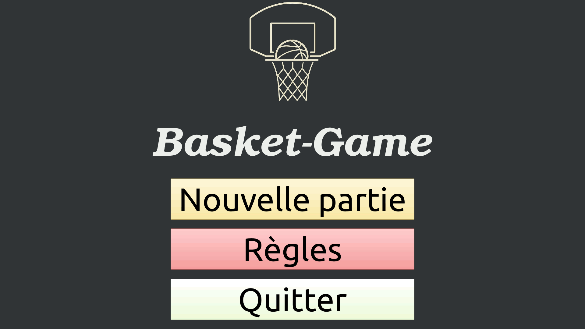
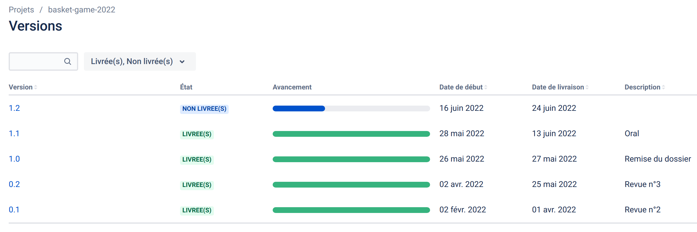
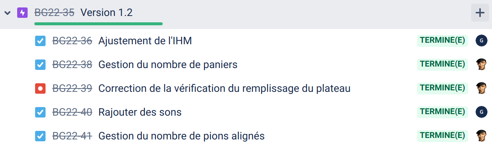
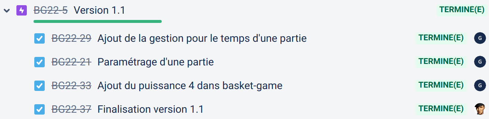
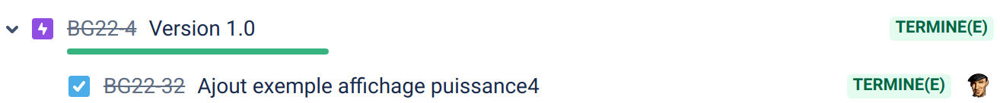
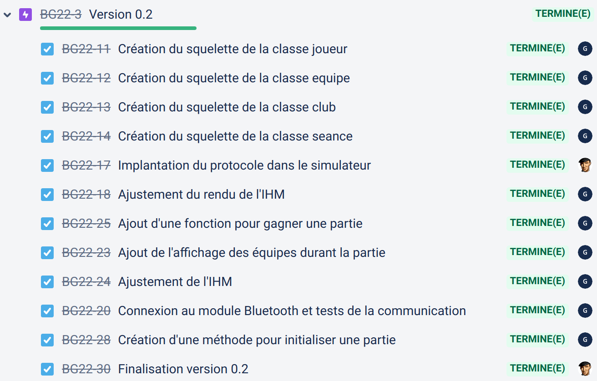
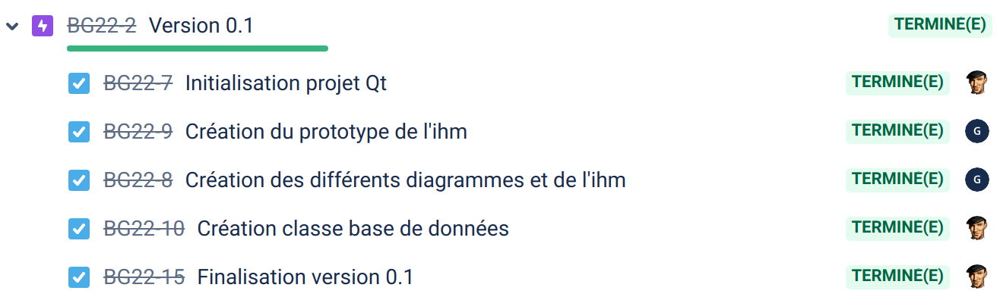
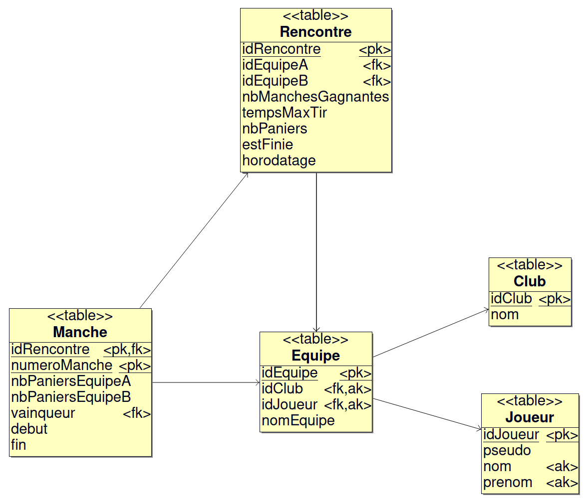
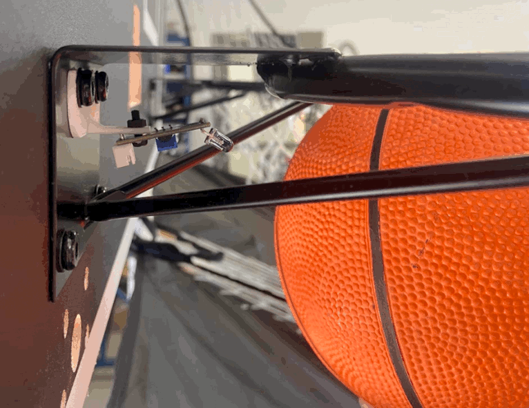

  

# Le projet basket-game-2022

“Entraînement ludique au tir de basket-ball“

- [Le projet basket-game-2022](#le-projet-basket-game-2022)
  - [Vidéo](#vidéo)
  - [Fonctionnalités](#fonctionnalités)
  - [TODO](#todo)
  - [Historique des versions](#historique-des-versions)
  - [Base de données](#base-de-données)
  - [Protocole](#protocole)
  - [Diaporama](#diaporama)
  - [Auteur](#auteur)
  - [Kanban](#kanban)
  - [EC](#ec)

## Vidéo

## Fonctionnalités

- Démarrer une nouvelle partie
- Paramétrer le temps de la partie et des tours
- Gérer le déroulement d'une partie
- Afficher le puissance 4
- Afficher les jetons en fonction des tirs
- Afficher le score d'une partie
- Afficher le vainqueur d'une partie
- Afficher les règles
- Produire des sons (tir réussi ou non, ...)
- Communiquer avec le module de détection

## TODO

- [ ] Gérer la base de données

## Historique des versions

- [Version 1.2](https://github.com/btssn-lasalle-84/basket-game-2022/releases/tag/1.2) : 28/06/2022

- [Version 1.1](https://github.com/btssn-lasalle-84/basket-game-2022/releases/tag/1.1) : 10/06/2022

- [Version 1.0](https://github.com/btssn-lasalle-84/basket-game-2022/releases/tag/1.0) : 27/05/2022

- [Version 0.2](https://github.com/btssn-lasalle-84/basket-game-2022/releases/tag/0.2) : 24/05/2022

- [Version 0.1](https://github.com/btssn-lasalle-84/basket-game-2022/releases/tag/0.1) : 02/04/2022

## Base de données

## Protocole

- [Protocole basket-game.pdf](docs/Protocole%20basket-game.pdf)

## Diaporama

- [Basket-Game Revue Finale - LAMBERT Guillaume.pptx](docs/Basket-Game%20Revue%20Finale%20-%20LAMBERT%20Guillaume.pptx)

## Auteur

- Guillaume Lambert <<guillaumelambert45@gmail.com>>

## Kanban

[basket-game-2022](https://github.com/btssn-lasalle-84/basket-game-2022/projects/1)

## EC

©️ LaSalle Avignon 2022
