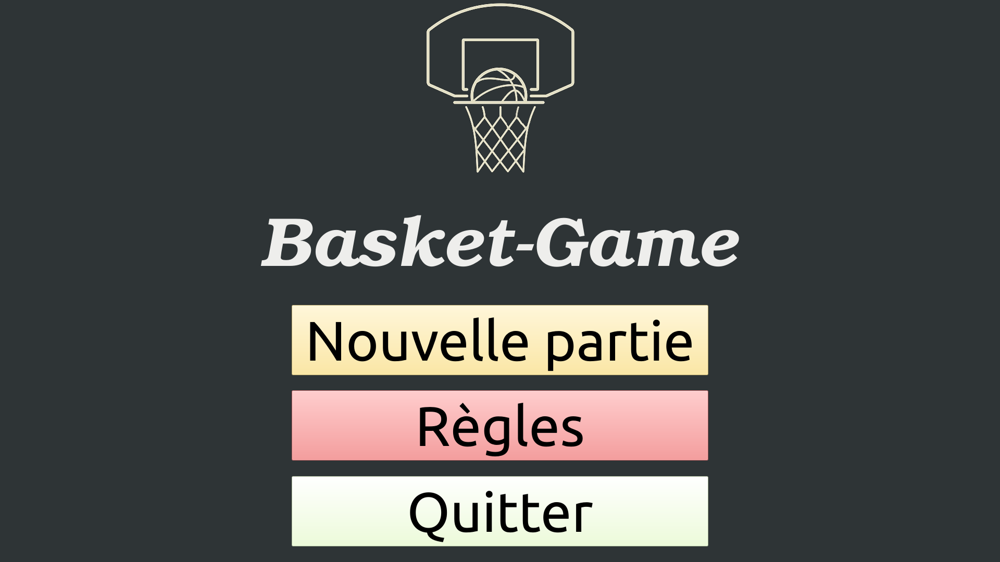
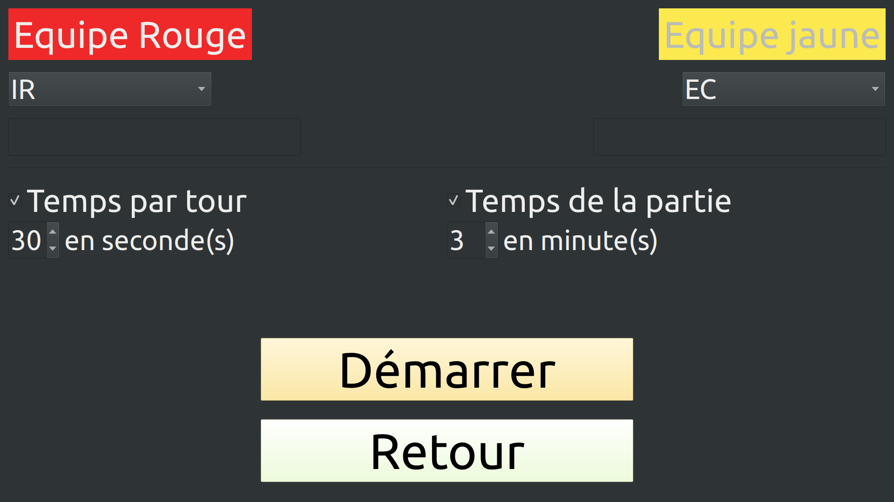

# Le projet basket-game-2022

“Entraînement ludique au tir de basket-ball“

## Fonctionnalités

- Démarrer une nouvelle partie
- Gérer le déroulement d'une partie
- Afficher le score d'une partie
- Afficher le vainqueur d'une partie
- Afficher les règles
- Communiquer avec le module de détection

## TODO

- [ ] Paramétrer le temps de la partie et des tours
- [ ] Afficher le puissance 4
- [ ] Afficher les jetons en fonction des tirs
- [ ] Option : Effectuer des sons par rapport à un tir réussi ou non

## Historique des versions

- Version 0.2 : 24/05/2022
- Version 0.1 : 02/04/2022

## Captures d'écran

La page d'accueil :

La page de configuration d'une nouvelle partie :

## Base de données

## Auteur

- Guillaume Lambert <<guillaumelambert45@gmail.com>>

## Kanban

[basket-game-2022](https://github.com/btssn-lasalle-84/basket-game-2022/projects/1)

